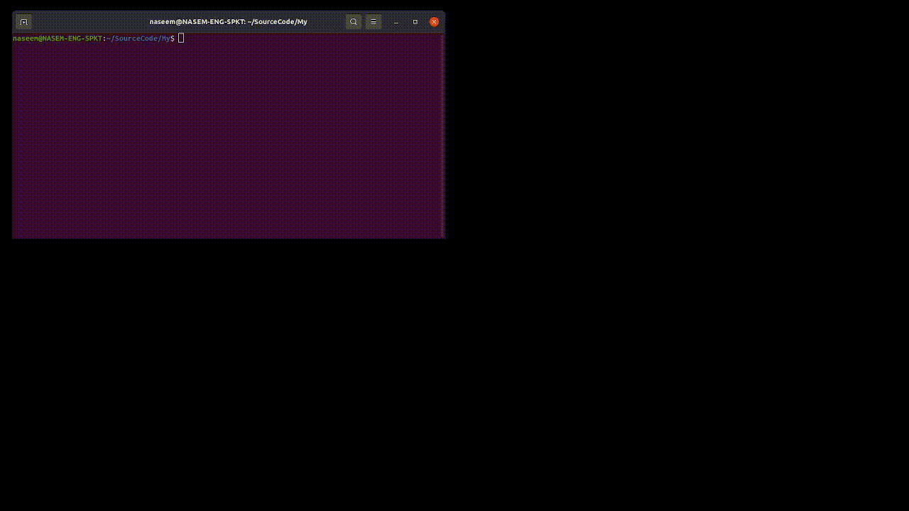

# VoiceChatGPT (Voice Assistant)
Use ChatGpt (openAi) by Voice i.e. using text to speech and speech to text.

Uses Google Voice Recognition for input and sends text to OpenAi then Again uses Google Speech Engine to speak the text provided by ChatGPT.

Youtube video can be watched at (https://youtu.be/R0vlGJXxeRc) , in this Video Demo, Python Script takes input in Voice Command (i.e. Tell me about Pakistan) and the script gets result from ChatGPT and reads the output in form of Speech.

naseem@technologist.com

